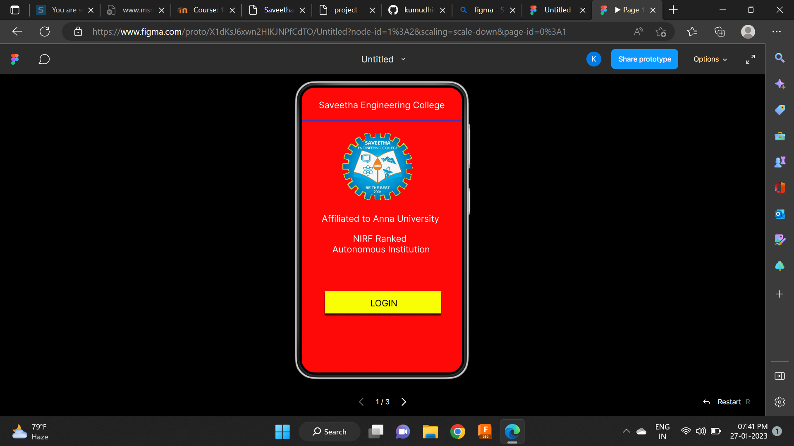
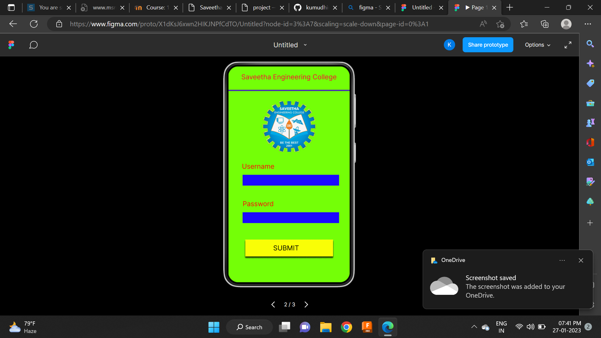
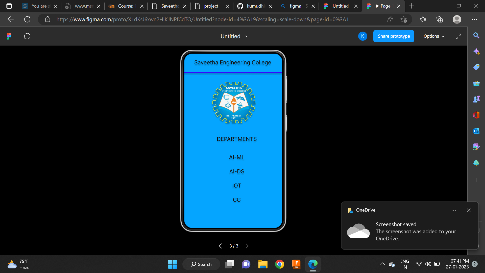

# Event Registration Web Application

## AIM:
To design, develop and deploy a web application for event registration.

## DESIGN STEPS:

### Step 1:
Create a new frame.

### Step 2:
Select any one preset size of your choice.

### Step 3:
Select the shapes you need.

### Step 4:
Import images as needed.

### Step 5:
Create pages based on your need and link them.

### Step 6:

Validate the HTML and CSS code.

### Step 6:

Publish the website in the given URL.

## DESIGN TOOL:
Figma

## code:
```
/* Home Page */
position: relative;
width: 360px;
height: 640px;
background: #FF0808;
box-shadow: 0px 4px 4px rgba(0, 0, 0, 0.25);

/* Login Page */
position: relative;
width: 360px;
height: 640px;
background: #74FF07;
box-shadow: 0px 4px 4px rgba(0, 0, 0, 0.25);

/* Saveetha Engineering College */
position: absolute;
width: 316px;
height: 35px;
left: 20px;
top: 20px;
font-family: 'Inter';
font-style: normal;
font-weight: 400;
font-size: 20px;
line-height: 24px;
text-align: center;
color: #111111;
text-shadow: 0px 4px 4px rgba(0, 0, 0, 0.25);


/* DEPARTMENTS */
position: absolute;
width: 316px;
height: 35px;
left: 35px;
top: 301px;
font-family: 'Inter';
font-style: normal;
font-weight: 400;
font-size: 20px;
line-height: 24px;
text-align: center;
color: #111111;
text-shadow: 0px 4px 4px rgba(0, 0, 0, 0.25);

/* AI-ML */
position: absolute;
width: 316px;
height: 35px;
left: 35px;
top: 368px;
font-family: 'Inter';
font-style: normal;
font-weight: 400;
font-size: 20px;
line-height: 24px;
text-align: center;
color: #111111;
text-shadow: 0px 4px 4px rgba(0, 0, 0, 0.25);

/* AI-DS */
position: absolute;
width: 316px;
height: 35px;
left: 35px;
top: 420px;
font-family: 'Inter';
font-style: normal;
font-weight: 400;
font-size: 20px;
line-height: 24px;
text-align: center;
color: #111111;
text-shadow: 0px 4px 4px rgba(0, 0, 0, 0.25);

/* IOT */
position: absolute;
width: 316px;
height: 35px;
left: 35px;
top: 472px;
font-family: 'Inter';
font-style: normal;
font-weight: 400;
font-size: 20px;
line-height: 24px;
text-align: center;
color: #111111;
text-shadow: 0px 4px 4px rgba(0, 0, 0, 0.25);

/* CC */
position: absolute;
width: 316px;
height: 35px;
left: 35px;
top: 524px;
font-family: 'Inter';
font-style: normal;
font-weight: 400;
font-size: 20px;
line-height: 24px;
text-align: center;
color: #111111;
text-shadow: 0px 4px 4px rgba(0, 0, 0, 0.25);

/* Line 3 */
position: absolute;
width: 371px;
height: 0px;
left: -4px;
top: 72px;
border: 4px solid #3806FF;
box-shadow: 0px 4px 4px rgba(0, 0, 0, 0.25);

/* logo 3 */
position: absolute;
width: 160px;
height: 150px;
left: 102px;
top: 104px;
background: url(logo);
filter: drop-shadow(0px 4px 4px rgba(0, 0, 0, 0.25));
```
## OUTPUT:




## RESULT:
The program to design, develop and deploy a web application for event registration is completed successfully.